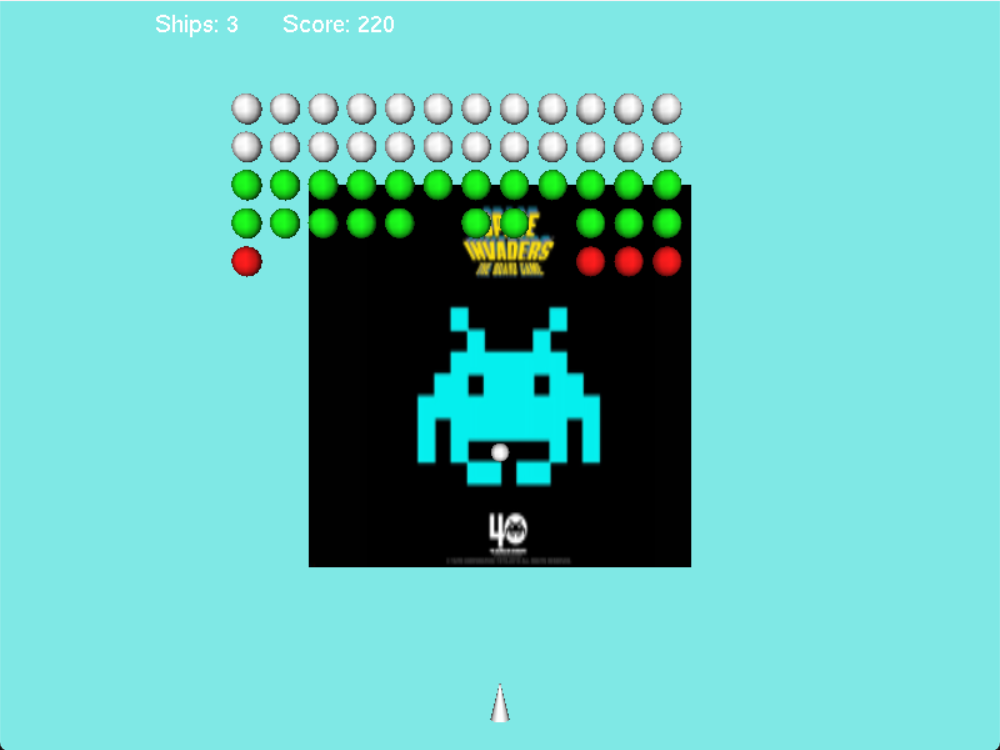

# Space Invaders — OpenGL / C++

A Space Invaders clone written in **C++** with **OpenGL/GLUT**, built on an object-oriented engine: a polymorphic `Shape` hierarchy, a linked-list object manager, and collision detection through operator overloading.

Project developed for the **Systems Programming** course (3rd year, Bachelor's in Industrial Technology Engineering — ETSII, UPM), on top of a base skeleton provided by the course.



---

## Gameplay

- Move the ship with **← / →**.
- Fire with **Space** (one bullet in flight at a time).
- Shoot the alien formation before it reaches the bottom; each alien is worth points depending on its type.
- Lose a life if an alien reaches your ship. The game ends when you run out of ships or the aliens land.

---

## Architecture

The engine is organized around a small class hierarchy and a dynamic object list:

```
Shape (abstract base: position, colour, speed, move/draw)
├── Alien     Formation enemies (type, colour, marching motion)
├── Bullet    Ship projectile
├── Ship      Player ship (fires bullets)
└── Ovni      UFO
```

- **`Lista` / `ObjectsList`** — a singly linked list that owns every game object and dispatches the `move()` / `draw()` messages each frame, plus add/remove.
- **`Invaders`** — manages the alien formation as a whole: detects the left/right/lowest edges and flips the marching direction.
- **Collision detection** — the `Alien::operator+` overload returns the distance between an alien and a bullet; `ObjectsList::collisions()` uses it to resolve bullet↔alien hits (removing both and scoring by alien type) and alien↔ship hits.
- **Rendering** — GLUT callbacks (`OnDibuja`, `myLogic`, keyboard handlers), a textured background loaded from a BMP, and double buffering.

---

## Repository structure

```
space-invaders-opengl/
├── src/                Source code (C++), the GLUT header and the background texture
│   ├── mainSI.cpp      Entry point, GLUT callbacks and game loop
│   ├── Shape.*         Abstract base class
│   ├── Alien/Bullet/Ship/Ovni.*   Game entities
│   ├── Lista.* / ObjectsList.*    Object manager (linked list)
│   ├── Invaders.*      Alien-formation logic
│   ├── GLstuff.cpp     OpenGL setup and texture loading
│   ├── SpaceInvaders.bmp   Background texture
│   └── makefile        Build rules (Linux / macOS)
└── docs/
    └── memoria.pdf     Technical report (Spanish)
```

---

## Build & run

The project uses OpenGL, GLU and GLUT.

**Linux:**
```bash
cd src
make Linux        # needs freeglut: sudo apt install freeglut3-dev
./SpaceInvadersGL
```

**macOS:**
```bash
cd src
make              # uses the GLUT/OpenGL frameworks
./SpaceInvadersGL
```

On Windows the sources build with Visual Studio / MinGW linking against `freeglut` and `opengl32`. Run the executable from the `src/` folder so it finds `SpaceInvaders.bmp`.

---

## Tech stack

`C++` · `OpenGL` · `GLUT` · `Object-oriented design` · `Operator overloading` · `Linked lists`

---

## Credits

Base skeleton by Prof. Claudio Rossi (Universidad Politécnica de Madrid). Game logic implemented as part of the Systems Programming coursework, ETSII (UPM).
